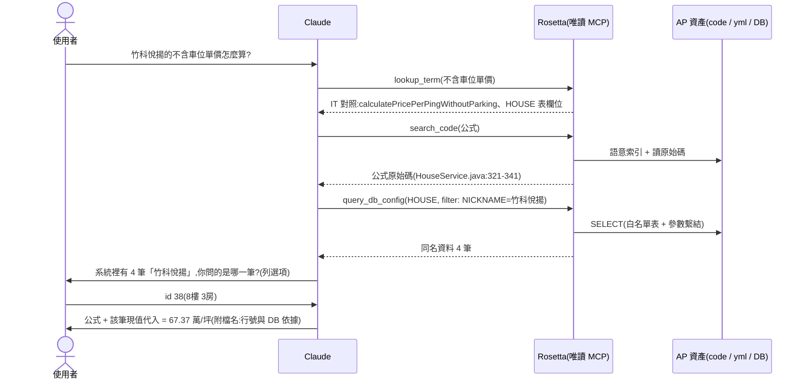

# Rosetta — 用自然語言問系統邏輯的知識庫(multi-AP MCP server)

讓**非工程師也能直接問系統邏輯**:「這個分數怎麼算的?」「篩選門檻是多少?」
「為什麼這筆被刷掉?」——在 Claude 裡用任何語言發問,答案來自**當下真實的**
程式碼、設定檔與 DB 現值,並且**一律附依據**(檔名:行號 / config key / DB 現值)。

一個團隊只要架**一台** Rosetta,就能服務團隊的 N 個 AP(系統);
「問題屬於哪個 AP」由 Claude 自動路由。全程**唯讀**,不動任何 AP 的東西。

> 架構規格:`docs/SPEC.md`;架設指南:`docs/QUICKSTART.md`;
> 通用模板:`nl-query-kb-template/`(由 `scripts/make_template.ps1` 產生)。

## 它能回答什麼

| 問題類型 | 例子 | 答案來源 |
|---|---|---|
| 公式與規則實作 | 「不含車位單價怎麼算?」 | 原始碼(語意檢索,附檔名:行號) |
| 設定現值 | 「評分權重現在是多少?」 | DB 設定表**即時查詢**(migration 裡的是舊值) |
| 系統設定 | 「連的是哪個資料庫?」 | application*.yml(密碼等敏感值自動遮罩) |
| 影響範圍 | 「這個公式被誰使用?」 | codegraph 呼叫圖(callers/callees) |
| 跨系統探索 | 「哪個系統有產生條碼?」 | 跨 AP 聯合查詢(discovery) |

## 運作流程

使用者問不清楚時,Rosetta 會提供「歧義訊號」讓 Claude **先確認再回答**,
而不是猜一個方向答錯。以真實案例走一遍:



## 核心能力

1. **業務用語對照(glossary)**:「權重」「被刷掉」這類口語 → 精確的
   class/欄位/config key,每 AP 一份 YAML,缺詞再補;
   防腐化 lint 自動檢測 rename 造成的失效條目。
2. **多語語意檢索**:本地 embedding(離線、不外送),口語提問可同時命中
   英文 identifier 與中文註解;索引未建好前自動以 grep 墊檔,當天可用。
3. **呼叫鏈結構**:codegraph 圖索引,回答「被誰用/用了誰/改了影響誰」。
4. **現值查詢**:application*.yml 與 DB 設定表即時讀取——權重、門檻這類
   邏輯存在 DB,只有現值可信;支援受限過濾精準取單筆(白名單 + 參數繫結)。
5. **歧義釐清**:glossary 多義、檢索分散、查無結果、DB 多筆同名四種訊號,
   引導 Claude 以 KB 真實候選做「選項式反問」——清楚就不問,最多問一次。
6. **跨 AP 探索**:`app="all"` 一次掃所有系統(每 AP 2 筆位置),
   找到歸屬後切回單一 AP 深查。
7. **唯讀安全**:不寫檔、不執行;DB 只 SELECT 白名單表(個資表明示排除)、
   敏感 config 值遮罩、防目錄穿越、HTTP 模式 Bearer 認證。

## 接入你的 AP 要做什麼

| 準備項 | 成本 |
|---|---|
| kb.config.yaml 加一個區塊(路徑、DB 白名單) | 約 10 分鐘 |
| DB 唯讀帳號(只授權白名單表 SELECT) | 看 DBA |
| 對照表 `config/glossary/<app>.yaml` | 骨架自動萃取,缺詞再補 |
| 索引(codegraph + 語意) | `scripts/index_all.py` 批次,掛排程 |

詳細步驟見 `docs/QUICKSTART.md`;tool 數固定 7 個,不隨 AP 數成長。

## 工具一覽(7 個,全部唯讀)

| 工具 | 說明 |
|------|------|
| `list_apps()` | 列出管理的 AP 與描述(Claude 路由用) |
| `lookup_term(query, app)` | 業務用語 → IT 對照(class/method/DB 欄位/config key) |
| `search_code(query, top_k, app, include_call_chain)` | 語意檢索原始碼,回 symbol 原文 |
| `get_structure(symbol, app)` | callers / callees / 定義位置(codegraph 圖) |
| `read_source(relative_path, app, start_line, end_line)` | 讀檔案或行範圍節錄(限該 AP 專案根內) |
| `get_app_config(key_pattern, app)` | 查 `application*.yml`;敏感值遮罩 |
| `query_db_config(table, limit, app, filter_column, filter_op, filter_value)` | 查 DB 設定表現值;白名單 + SELECT only;受限過濾(eq/contains,欄位名驗證、值繫結) |

`app` 參數:單一 AP 時可省略;`lookup_term` / `search_code` 可帶 `"all"` 做
跨 AP 探索(discovery:分組、每 AP 2 筆位置、只走 semantic;確認歸屬後切回
單一 app 深查)。

## 專案結構

```
rosetta/               server 核心(MCP 層與檢索引擎)
  kb_server.py         MCP 層(7 tools、instructions、防目錄穿越、app 路由、HTTP+token)
  kb_config.py         config/kb.config.yaml → AppContext(per-AP 路徑/DB/glossary)
  glossary.py          對照表比對/展開/boost
  semantic_search.py   語意檢索(向量內積 + 字面 boost;不掃 repo)
  semantic_index.py    語意索引建置(NL 訊號 embedding;content-hash 增量)
  graph_db.py          codegraph.db 唯讀存取(schema v6 鎖定)
  code_search.py       grep 引擎(auto 的自動墊檔:索引未就緒/損壞時)
  app_config.py        application*.yml 解析(local 覆蓋 base、敏感遮罩)
  db_config.py         DB 設定表查詢(mariadb 實測;oracle 就緒未實測)
  kb_log.py            logging(stderr + 可選檔案;stdio 的 stdout 是協定通道)
scripts/               維運腳本
  index_all.py         批次索引(--pull / --rebuild / --app;附帶 glossary lint)
  glossary_lint.py     對照表防腐化檢測(it_terms ↔ codegraph/config/白名單)
  log_report.py        log 彙整報表(用量/歧義訊號統計/glossary 補詞候選)
  eval_e2e.py          E2E 自動驗收(headless claude 逐題實測 + 判分)
  extract_glossary.py  對照表骨架萃取(--app)
  eval_retrieval.py    embedding 模型評測(eval/ 題庫)
  setup.ps1            venv + 依賴 + .mcp.json 範本 + selftest
  make_template.ps1    產出通用模板(nl-query-kb-template/;code 只在這裡維護)
tests/                 selftest.py(功能驗證)、selftest_multiapp.py(multi-AP 隔離)
config/                kb.config.yaml + glossary/<app>.yaml(團隊資產,進版控)
eval/                  題庫、驗收基準、fixture app
docs/                  SPEC / QUICKSTART / PLAN / TODO / ENTERPRISE-GAP
```

## 常用操作

```powershell
# 安裝 / 搬移後重建
powershell -ExecutionPolicy Bypass -File scripts\setup.ps1

# 索引更新(AP code 有 commit 後跑這個:自動 git pull → codegraph sync → 語意增量)
.\.venv\Scripts\python.exe -X utf8 scripts\index_all.py --pull

# 集中部署(HTTP;stdio 開發模式由 .mcp.json 自動叫起)
$env:KB_TRANSPORT="http"; $env:KB_AUTH_TOKEN="<token>"
.\.venv\Scripts\python.exe -X utf8 rosetta\kb_server.py

# 驗證
.\.venv\Scripts\python.exe -X utf8 tests\selftest.py           # 功能驗證
.\.venv\Scripts\python.exe -X utf8 tests\selftest_multiapp.py  # multi-AP 隔離
```

改了 server code → 重啟(stdio 則 `/mcp` Reconnect),並重跑 `scripts\make_template.ps1`
同步模板。索引重建後 server 不用重啟;**新增/移除 AP 需重啟**(MCP instructions 的
AP 清單是啟動時組好的)。環境變數:`KB_TRANSPORT`、`KB_HTTP_HOST/PORT`、
`KB_AUTH_TOKEN`、`KB_ENGINE`、`KB_EMBED_MODEL`、`KB_LOG_LEVEL`、`KB_LOG_FILE`。

log:一律走 stderr(stdio 模式 stdout 是 MCP 協定通道;Claude Code 收進
mcp-logs),`KB_LOG_FILE` 設定時另寫檔案。INFO 記 tool 呼叫/歧義訊號(S1~S3),
WARNING 記拒絕事件(白名單/敏感表/filter/路徑穿越/401),ERROR 記 DB 失敗。
彙整報表:`scripts\log_report.py`。HTTP 模式另有 `GET /health`(免認證監控)。

## 注意

- 權重/門檻的**現值只在 DB**,程式碼與 migration 看不到。
- glossary 只維護 zh、只存名詞對應不存公式;編輯後需重跑索引(觸發該 AP 全量)。
- codegraph 圖缺 DI/反射邊;中文 docstring 亂碼已繞過(註解由 kb 自抽 UTF-8)。
- venv 綁絕對路徑;`.ps1` 要 UTF-8 with BOM。
