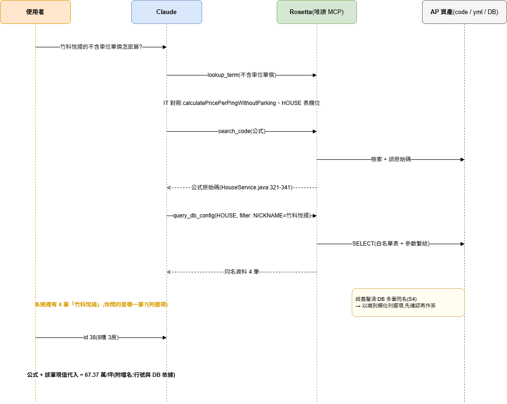
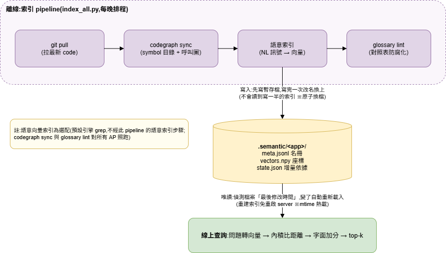

# Rosetta — 用自然語言問系統邏輯的知識庫(multi-AP MCP server)

讓**非工程師也能直接問系統邏輯**:「這個分數怎麼算的?」「篩選門檻是多少?」
「為什麼這筆被刷掉?」——在 Claude 裡用任何語言發問,答案來自**當下真實的**
程式碼、設定檔與 DB 現值,並且**一律附依據**(檔名:行號 / config key / DB 現值)。

一個團隊只要架**一台** Rosetta,就能服務團隊的 N 個 AP(系統);
「問題屬於哪個 AP」由 Claude 自動路由。全程**唯讀**,不動任何 AP 的東西。

> 架構規格:`docs/SPEC.md`;架設指南:`docs/QUICKSTART.md`;
> 通用模板:`nl-query-kb-template/`(由 `scripts/make_template.ps1` 產生)。

## 它能回答什麼

| 問題類型 | 例子 | 答案來源 |
|---|---|---|
| 公式與規則實作 | 「不含車位單價怎麼算?」 | 原始碼(語意檢索,附檔名:行號) |
| 設定現值 | 「評分權重現在是多少?」 | DB 設定表**即時查詢**(migration 裡的是舊值) |
| 系統設定 | 「連的是哪個資料庫?」 | application*.yml(密碼等敏感值自動遮罩) |
| 影響範圍 | 「這個公式被誰使用?」 | codegraph 呼叫圖(callers/callees) |
| 跨系統探索 | 「哪個系統有產生條碼?」 | 跨 AP 聯合查詢(discovery 探索模式) |

## 運作流程

使用者問不清楚時,Rosetta 會提供「歧義訊號」讓 Claude **先確認再回答**,
而不是猜一個方向答錯。以真實案例走一遍:



## 核心能力

1. **業務用語對照(glossary)**:「權重」「被刷掉」這類口語 → 精確的
   class/欄位/config key,每 AP 一份 YAML,缺詞再補;
   防腐化 lint 自動檢測 rename 造成的失效條目。
2. **多語檢索**:預設 grep 引擎(英文 identifier + 中文註解逐兩字比對(bigram)+ glossary 展開三合一);
   語意 embedding 為選配加速器,大型 repo 或命名極差時再開。實測:命名尚可且有維護
   glossary 時,語意索引相對 grep 幾乎零增益(`eval/ABLATION.md`)。
3. **呼叫鏈結構**:codegraph 圖索引,回答「被誰用/用了誰/改了影響誰」。
4. **現值查詢**:application*.yml 與 DB 設定表即時讀取——權重、門檻這類
   邏輯存在 DB,只有現值可信;支援受限過濾精準取單筆(白名單 + 參數繫結)。
5. **歧義釐清**:工具回傳附三種歧義訊號(glossary 多義、檢索分散、查無結果),
   引導 Claude 以 KB 真實候選做「選項式反問」——清楚就不問,最多問一次。
   (流程圖中「DB 多筆同名」的反問是 MCP instructions 引導 Claude 從查詢結果自行辨識,非 server 偵測的訊號。)
6. **跨 AP 探索**:`app="all"` 一次掃所有系統(每 AP 2 筆位置),
   找到歸屬後切回單一 AP 深查。
7. **唯讀安全**:不寫檔、不執行;DB 只 SELECT 白名單表(個資表明示排除)、
   敏感 config 值遮罩(`get_app_config` 與 `read_source` 讀 yml/properties
   皆遮罩,無繞道)、防目錄穿越、HTTP 模式 Bearer 認證。
8. **跨團隊轉介(fleet 目錄,選配)**:使用者問到「不歸本站管」的系統時,
   依 `fleet:` 目錄引導到對方團隊的 Rosetta(附連線方式)或聯絡窗口/文件,
   而不是回「查無結果」或硬答——對方團隊**不需要**先裝 Rosetta 就能列入目錄
   (SPEC §4.10)。

## 索引 pipeline 與向量索引(口語為什麼能命中程式碼)

> 註:語意向量索引為**選配**(預設引擎是 grep;實測在命名尚可、有維護 glossary 的 AP 上
> 相對 grep 幾乎零增益,見 `eval/ABLATION.md`)。以下說明的是「開啟 semantic 時」的運作,
> 以及它相對 grep 獨有的能力(純語意換句話說的匹配、可預建以支撐 `app="all"` 跨 AP 探索)。

檢索分兩個階段:**離線建索引**(排程)與**線上查詢**(< 1 秒)。



**向量索引是一張「語意地圖」**:embedding model 把每段文字變成一組數字座標
(e5-large 為 1024 維),意思相近的文字座標會靠近。建索引 = 把每個 symbol
釘上地圖;查詢 = 把問題也轉成座標、找最近的釘子。比的是「意思的距離」而非
「共同的字」,所以「每坪多少錢」能命中 `calculatePricePerPingWithoutParking`
——兩者沒有任何共同字,grep 做不到。

**每個 symbol 進地圖前,先組「NL 訊號」而非整段 code**(embedding model 擅長
自然語言,`if/return` 只是噪音)。訊號共五種,以不含車位單價公式為例:

```
calculatePricePerPingWithoutParking          ← ① identifier 本身+拆詞(calculate price per ping …)
method | HouseService | house service        ← ② 種類+所屬 class(拆詞)
@Column(name="TOTAL_PRICE") 等               ← ③ annotation(DB 欄位名一併進訊號)
計算不含車位的每坪單價                        ← ④ 宣告上方+行尾註解(自原始碼 UTF-8 抽取)
不含車位單價 每坪多少錢 扣掉車位的價格 …      ← ⑤ glossary 反向注入(業務詞整串)
```

五種訊號缺一還有四:method 取名再爛(如 `aaa`),只要有註解(④)或
glossary 對照(⑤),照樣命中;五種全缺才會在語意檢索中隱形。

**線上查詢五步**(以「不含車位的每坪單價怎麼算?」為例):

1. glossary 展開:命中「不含車位單價」→ 得到 `calculate/price/ping/parking…`
2. 問題轉向量(唯一一次 model 運算)
3. 與全部 symbol 向量做內積(約 1k symbols < 1ms)
4. 字面加分:identifier 命中查詢詞/展開詞的往前排
   (`calculatePricePerPingWithoutParking` 命中 5 詞,壓過只沾 `price` 的 `totalPrice`)
5. 回傳 top-k 的檔名:行號 + 原始碼 + 一層呼叫鏈

**增量**:排程以 codegraph 的檔案內容指紋(content-hash)比對,只重嵌有變更的檔案——
AP 沒 commit 時幾乎零成本;換 model 或改 glossary 自動全量重建(座標系變了,
整張地圖重畫)。

### 提升命中率的實務手冊(命名很爛的舊系統怎麼辦?)

| 優先 | 作法 | 成本 | 為什麼有效 |
|---|---|---|---|
| 1 | **補 glossary**:業務詞 → `it_terms` 指到 method/欄位 | 一條 YAML | 雙重生效:索引期注入語意(⑤)+ 查詢期字面加分精確命中;名稱是 `aaa` 也救得回來 |
| 2 | **關鍵 method 補一行中文註解**(挑常被問的公式/規則) | 一行 `//` | 整句進訊號④,效果 ≈ 取個好名稱 |
| 3 | **用 log 報表決定補什麼**:`log_report.py` 的「S3 空手 query」= 使用者查了但 KB 接不住的詞 | 每月看一次 | 缺詞再補從被動變主動,補在刀口上 |
| 4 | **AP description 寫人話**(kb.config.yaml) | 一句話 | 治「問題送錯系統」——路由錯了檢索再準也沒用 |

補完 glossary/註解後跑 `scripts/index_all.py` 生效(glossary 變更自動觸發
該 AP 全量重建)。**不建議**:為檢索大規模 rename 舊程式碼(一條 glossary
同效果、零風險)、把公式抄進 glossary(會過期;公式永遠以程式碼為準)。

## 接入你的 AP 要做什麼

| 準備項 | 成本 |
|---|---|
| kb.config.yaml 加一個區塊(路徑、DB 白名單) | 約 10 分鐘 |
| DB 唯讀帳號(只授權白名單表 SELECT) | 看 DBA |
| 對照表 `config/glossary/<app>.yaml` | 骨架自動萃取,缺詞再補 |
| 索引(codegraph + 語意) | `scripts/index_all.py` 批次,掛排程 |

詳細步驟見 `docs/QUICKSTART.md`;tool 數固定 7 個,不隨 AP 數成長。

## 工具一覽(7 個,全部唯讀)

| 工具 | 說明 |
|------|------|
| `list_apps()` | 列出管理的 AP 與描述(Claude 路由用);設定 `fleet:` 時另列「其他團隊的系統」轉介區段 |
| `lookup_term(query, app)` | 業務用語 → IT 對照(class/method/DB 欄位/config key) |
| `search_code(query, top_k, app, include_call_chain)` | 語意檢索原始碼,回 symbol 原文(top_k 上限 10) |
| `get_structure(symbol, app)` | callers / callees / 定義位置(codegraph 圖) |
| `read_source(relative_path, app, start_line, end_line)` | 讀檔案或行範圍節錄(限該 AP 專案根內;yml/properties 敏感值遮罩) |
| `get_app_config(key_pattern, app)` | 查 `application*.yml`;敏感值遮罩 |
| `query_db_config(table, limit, app, filter_column, filter_op, filter_value)` | 查 DB 設定表現值;白名單 + SELECT only;受限過濾(eq/starts_with/contains,欄位名驗證、值繫結);DB 端 10s 執行上限 |

`app` 參數:單一 AP 時可省略;`lookup_term` / `search_code` 可帶 `"all"` 做
跨 AP 探索(discovery:分組、每 AP 2 筆位置、只走 semantic;確認歸屬後切回
單一 app 深查)。`search_code(app="all")` 只涵蓋有語意索引的 AP(`engine: semantic`,
或 `auto` 且已建索引);純 grep 的 AP 會被略過,靠 `list_apps` 描述路由即可
(見 SPEC §4.9)。`lookup_term(app="all")` 只用 glossary,不受影響。

## 專案結構

```
rosetta/               server 核心(MCP 層與檢索引擎)
  kb_server.py         MCP 層(7 tools、instructions、防目錄穿越、app 路由)
  http_transport.py    HTTP 集中部署(Bearer 認證、GET /health、uvicorn)
  kb_config.py         config/kb.config.yaml → AppContext(per-AP 路徑/DB/glossary)
  glossary.py          對照表比對/展開/boost
  semantic_search.py   語意檢索(向量內積 + 字面 boost;不掃 repo)
  semantic_index.py    語意索引建置(NL 訊號 embedding;content-hash 增量)
  graph_db.py          codegraph.db 唯讀存取(schema v6 鎖定)
  code_search.py       grep 引擎(auto 的自動墊檔:索引未就緒/損壞時)
  app_config.py        application*.yml 解析(local 覆蓋 base、敏感遮罩)
  db_config.py         DB 設定表查詢(mariadb 實測;oracle 就緒未實測)
  kb_log.py            logging(stderr + 可選檔案;stdio 的 stdout 是協定通道)
scripts/               維運腳本
  index_all.py         批次索引(--pull / --rebuild / --app;附帶 glossary lint)
  glossary_lint.py     對照表防腐化檢測(it_terms ↔ codegraph/config/白名單)
  log_report.py        log 彙整報表(用量/歧義訊號統計/glossary 補詞候選)
  extract_glossary.py  對照表骨架萃取(--app)
  eval_retrieval.py    embedding 模型評測(eval/ 題庫;排序與語料同 production)
  fleet_eval.py        引擎決策實驗 Tier1+2(逐 AP 規模/延遲/分歧/命名 → 建議 grep|semantic)
  eval_ablation.py     引擎決策實驗 Tier3(逐 AP grep vs semantic 命中率;需標註題庫)
  script_args.py       scripts 共用的 --flag 參數解析
  setup.ps1            venv + 依賴 + .mcp.json 範本 + selftest
  make_template.ps1    產出通用模板(nl-query-kb-template/;code 只在這裡維護)
tests/                 selftest.py(功能驗證)、selftest_multiapp.py(multi-AP 隔離)、
                       unit/(pytest 單元測試,無外部依賴,coverage 79%)
config/                kb.config.yaml + glossary/<app>.yaml(團隊資產,進版控)
eval/                  題庫、驗收基準、fixture app、FLEET-EVAL 協定與 ablation 報告
docs/                  SPEC / QUICKSTART / PLAN / TODO / ENTERPRISE-GAP
docs/diagrams/         架構圖(*.drawio.png:PNG 內嵌 draw.io XML,可直接編輯)
```

## 常用操作

```powershell
# 安裝 / 搬移後重建
powershell -ExecutionPolicy Bypass -File scripts\setup.ps1

# 索引更新(AP code 有 commit 後跑這個:自動 git pull → codegraph sync → 語意增量)
.\.venv\Scripts\python.exe -X utf8 scripts\index_all.py --pull

# 集中部署(HTTP;stdio 開發模式由 .mcp.json 自動叫起)
$env:KB_TRANSPORT="http"; $env:KB_AUTH_TOKEN="<token>"
.\.venv\Scripts\python.exe -X utf8 rosetta\kb_server.py

# 驗證
.\.venv\Scripts\python.exe -X utf8 tests\selftest.py           # 功能驗證(需 BestHouse 環境)
.\.venv\Scripts\python.exe -X utf8 tests\selftest_multiapp.py  # multi-AP 隔離
.\.venv\Scripts\python.exe -m pip install -r requirements-dev.txt        # pytest(一次)
.\.venv\Scripts\python.exe -X utf8 -m pytest tests\unit --cov=rosetta --cov=scripts  # 單元測試(無外部依賴)
```

改了 server code → 重啟(stdio 則 `/mcp` Reconnect),並重跑 `scripts\make_template.ps1`
同步模板。索引重建後 server 不用重啟;**新增/移除 AP 或 fleet 區段需重啟**
(MCP instructions 的 AP 清單與轉介規則是啟動時組好的;fleet 條目內容修改即時生效)。環境變數:`KB_TRANSPORT`、`KB_HTTP_HOST/PORT`、
`KB_AUTH_TOKEN`、`KB_ENGINE`、`KB_EMBED_MODEL`、`KB_LOG_LEVEL`、`KB_LOG_FILE`。

log:一律走 stderr(stdio 模式 stdout 是 MCP 協定通道;Claude Code 收進
mcp-logs),`KB_LOG_FILE` 設定時另寫檔案。INFO 記 tool 呼叫/歧義訊號(S1~S3),
WARNING 記拒絕事件(白名單/敏感表/filter/路徑穿越/401),ERROR 記 DB 失敗。
彙整報表:`scripts\log_report.py`。HTTP 模式另有 `GET /health`(免認證監控)。

## 注意

- **token = 完整原始碼讀取權**:`read_source` 只限制在各 AP 的 repo_root 內
  (不限 search_dirs/副檔名),拿到 token 即可分段讀出所有 AP 的整個 repo。
  發 token 給外團隊(fleet 轉介)前請確認可接受;揭露分級(guest token /
  server 端摘要層)已規劃未實作(SPEC §7、TODO Phase 15)。
- 權重/門檻的**現值只在 DB**,程式碼與 migration 看不到。
- glossary 只維護 zh、只存名詞對應不存公式;編輯後需重跑索引(觸發該 AP 全量)。
- codegraph 圖缺 DI/反射邊;中文 docstring 亂碼已繞過(註解由 kb 自抽 UTF-8)。
- venv 綁絕對路徑;`.ps1` 要 UTF-8 with BOM。
