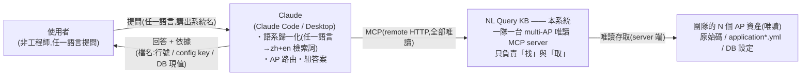
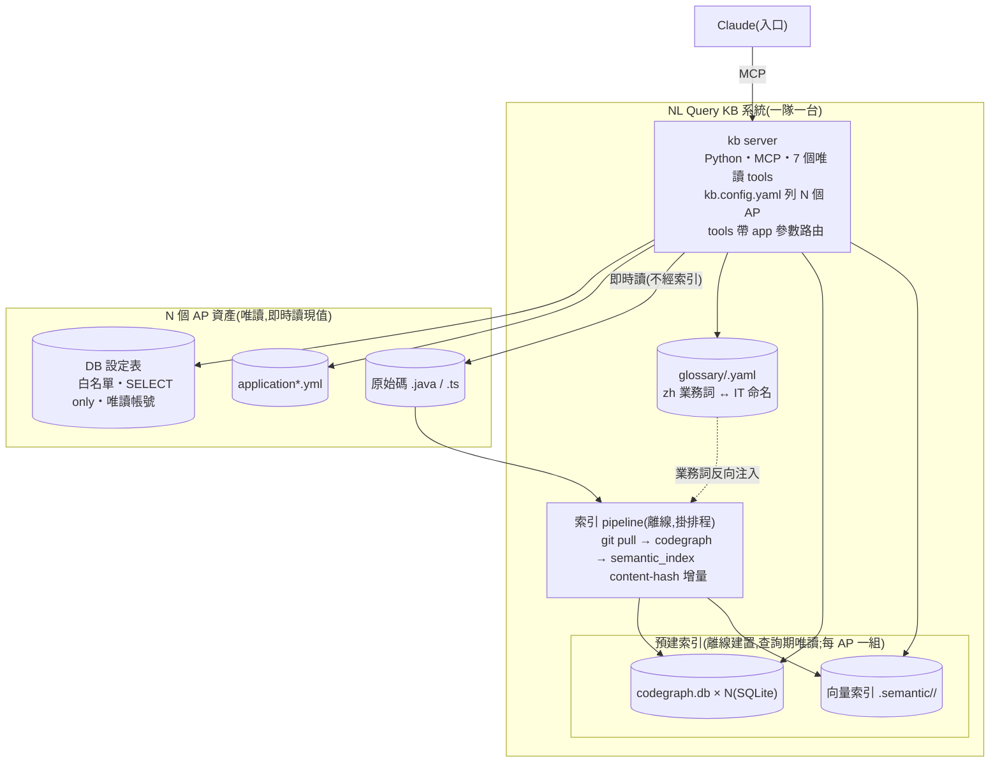
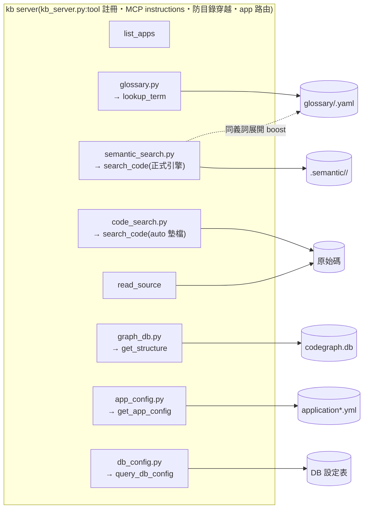

# SPEC — NL Query KB(自然語言查詢系統邏輯)

> 團隊架設:[QUICKSTART.md](QUICKSTART.md);使用者安裝:[USER-GUIDE.md](USER-GUIDE.md)。
> 驗證場域:BestHouse。

## 1. 目的與分工

使用者(非工程師)透過 Claude 用任何語言提問,由 Claude 讀取**當下真實的**
程式碼、AP config、DB 現值後回答,並附依據(檔名:行號 / config key / DB 現值)。

**分工:kb server 只負責「找」與「取」(全部唯讀);Claude 負責「懂」與「譯」**
(語系歸一化、AP 路由、讀 code 組答案)。安全機制(白名單、遮罩、唯讀)在
server 端強制,不依賴模型自律。

| 問題 | 解法 |
|---|---|
| 多語言提問 | Claude 檢索前改寫成「zh 業務詞 + en IT 詞」(慣例內建於 MCP instructions,§4.6) |
| 使用者用語 ≠ IT 命名 | glossary:zh 業務詞 ↔ it_terms 的精確錨點(repo 專屬知識,§4.1) |
| 邏輯不只在 code | config tools 即時讀 yml 與 DB 現值(§4.4) |
| 規模(百萬~千萬行) | 離線預建索引,查詢期不全掃描(§4.2、§4.5) |

## 2. 部署形態

一個團隊架**一台 multi-AP server**:一份 server code + 一份設定列 N 個 AP,
tools 以 `app` 參數選系統,tool 總數固定 7 個。

| 模式 | 傳輸 | 對象 |
|---|---|---|
| 集中式(正式) | streamable HTTP + `KB_AUTH_TOKEN` Bearer 認證 | 使用者(Claude Desktop 加 Connector URL,零安裝);repo 與 DB 帳密只存伺服器 |
| 本機(開發) | stdio(.mcp.json) | 開發者除錯 |

## 3. 架構(C4)

### 3.1 Level 1 — System Context



### 3.2 Level 2 — Container



- 查詢期只做 ANN + SQLite lookup + 即時讀現值,延遲與 repo 行數脫鉤。
- config tools 與 read_source 即時讀現值/原文,無 staleness。

### 3.3 Level 3 — Component



檢索三層,各司其職:

| 層 | 負責 | 不能省的原因 |
|---|---|---|
| glossary(名詞) | 業務用語 → IT 命名的精確錨點 | repo 專屬對應,Claude 猜不到 |
| 向量(語意) | 口語的模糊比對(zh/en) | 口語命中 en identifier + zh 註解,且可預建索引 |
| 圖(結構) | callers / callees / 跨檔追蹤 | 公式散在呼叫鏈上時需要「線」 |

## 4. 元件規格

### 4.1 glossary

- 每 AP 一份 YAML,進版控;**只維護 zh** aliases ↔ it_terms(其他語言由 Claude 翻譯)。
  ```yaml
  - term: 房子分數
    aliases: [總分, 評分, 分數]
    it_terms: [HOUSE_RATING, RATING_DIMENSION.WEIGHT, HouseService.calculateScore]
    note: 各維度分數 × 權重加總,權重存於 DB
  ```
- zh 子字串比對;**只存名詞對應、不存公式**(公式讓 AI 讀 code,不會過期)。
- 骨架由 `extract_glossary.py --app <name>` 產生,缺詞再補,不求全。

### 4.2 語意索引與引擎

- **索引單位**:symbol(method / class / config key),來自 codegraph。
- **embedding 輸入餵 NL 訊號,不餵整段 code**:identifier 拆詞 + 註解
  (kb 自行 UTF-8 抽取)+ class 名 + annotation + glossary 反向注入。
- **model**:預設 `intfloat/multilingual-e5-large`;輕量選項
  `paraphrase-multilingual-MiniLM-L12-v2`(索引快 15 倍,de 原文直查較弱;
  Claude 歸一化後 zh/en 無差)。`embed_model` / `KB_EMBED_MODEL` 切換,換 model 自動全量重建。
- **向量庫**:numpy 單檔內積(BestHouse 規模 < 1ms);規模化換 hnswlib/Qdrant,介面不變。
- **增量**:codegraph content-hash 判斷變更檔;glossary 或 model 變更自動全量。
- **混合排序**:ANN 相似度 + 字面 boost 按命中詞數累計
  (親打詞每詞 +0.08 封頂 0.24、glossary 展開詞每詞 +0.04 封頂 0.20)。
- **引擎依賴鏈(單向)**:codegraph 建圖 → 語意索引 → semantic 引擎。
  `engine: auto` 下索引未就緒/損壞時自動墊檔 grep(讀當下磁碟、零索引),
  就緒後自動切回。手動鎖 grep 僅適合不維護索引的丟棄式小 AP。

### 4.3 get_structure

- 輸入 symbol → callers / callees / 位置;唯讀直讀 `codegraph.db`(鎖 schema v5,
  版本不符回警告不中斷)。
- `search_code` 可附一層呼叫鏈(`include_call_chain`,預設開)。
- **可信度界線**:tree-sitter 是語法層解析——Spring DI、interface 實作、反射、
  動態呼叫的邊抓不到,「沒有 caller」不等於沒人用;變更影響評估需全文搜尋交叉確認。
  根治 = 企業版換型別感知 indexer(SCIP-Java / Spoon)。

### 4.4 config tools

| Tool | 功能 | 安全 |
|---|---|---|
| `get_app_config(key_pattern, app)` | 解析 `application*.yml`,回 key/value 與來源檔 | 敏感 key 遮罩 |
| `query_db_config(table, limit, app)` | 查 DB 設定表現值 | 白名單 + SELECT only;敏感表排除並附理由 |

### 4.5 規模矩陣

| repo 規模 | 語意引擎 | 結構引擎 | 查詢延遲 |
|---|---|---|---|
| < 10 萬行 | 本地 embedding(首建秒~分鐘) | codegraph(tree-sitter) | < 1s |
| 10 萬 ~ 百萬行 | 同上 + hnswlib | codegraph | < 1s |
| 百萬 ~ 千萬行 | 分片 ANN + int8 量化(60~100 萬 symbols ≈ 0.7~1 GB,單機可載) | SCIP-Java / Spoon | p95 < 3s |

查詢期禁止全掃描;字面全掃描無法解口語比對,換 ripgrep 也一樣。

### 4.6 MCP instructions(內建於 server,Claude 連上即遵守)

1. 先判斷問題屬於哪個 AP,tools 帶 `app` 參數;不確定先 `list_apps`,再不確定問使用者。
2. 檢索前把問題改寫成「zh 業務詞 + en IT 詞」兩組檢索詞。
3. 業務用語先 `lookup_term` 拿精確 IT 對應,再 `search_code`。
4. 公式散在呼叫鏈上用 `get_structure` 追。
5. 權重/規則/門檻/連線的「現值」必查 `query_db_config` / `get_app_config`,不得引用舊值。
6. 回答附依據(app 名 + 檔名:行號 / config key / DB 現值),以提問語言作答;查不到就明說。

### 4.7 設定(kb.config.yaml)

```yaml
server_name: your-team-kb
apps:
  - name: your-app             # app 參數值
    description: 一句話說明     # Claude 路由依據,寫使用者聽得懂的話
    repo_root: ../your-app
    search_dirs: [backend/src, frontend/src]
    resources_dir: backend/src/main/resources
    entity_dir: backend/src/main/java/.../entity   # glossary 萃取用,可省略
    glossary: glossary/your-app.yaml
    db:
      driver: mariadb          # mariadb | oracle(oracle 未實測)
      table_whitelist: [YOUR_CONFIG_TABLE]
      sensitive_tables: {MEMBER: 含個資,排除}
engine: auto                   # app 區塊可覆蓋
embed_model: ""                # 空 = e5-large
```

編輯即時生效(mtime 快取),不需重啟 server。環境變數:
`KB_TRANSPORT`(stdio|http)、`KB_HTTP_HOST/PORT`(預設 127.0.0.1:8600)、
`KB_AUTH_TOKEN`(http 的 Bearer 認證)、`KB_ENGINE`、`KB_EMBED_MODEL`。

## 5. 驗收標準

- zh 母本 10 題(涵蓋 code / DB / yml / 跨源),門檻 **≥ 9/10**;
  de / ja 各抽 2 題,引用來源需與 zh 版一致(ja 題只存資料檔)。
- 每題:引用正確來源、無幻覺、跨源題同時引 code 與 DB 現值。
- 多 AP 路由:模糊問題應選對 `app` 或先確認,不得跨 AP 引用。
- 延遲:search_code < 1s(BestHouse);規模外推見 §4.5。

## 6. 非目標

- 不做 Web UI、不做寫入、不做權限控管/多使用者、不做即時索引(分鐘級 staleness 可接受)。
- 不實測百萬行效能(試算外推);Claude 通道選型與資安審查為企業導入議題。

## 7. 已知限制

- Oracle driver 程式就緒但**未實測**;首個 Oracle AP 導入前先驗。
- HTTP 未設 `KB_AUTH_TOKEN` 時無認證,僅限信任內網;token 注入依 Claude 通道能力,
  必要時走反向代理。
- codegraph 圖缺 DI/反射邊(§4.3);中文 docstring 在 Windows 為亂碼,註解由 kb 自抽。
- 絕對路徑:搬移目錄後重跑 `setup.ps1`。

## 8. 企業化差距

| 面向 | 現況 | 企業(百萬~千萬行) |
|---|---|---|
| 語意檢索 | 本地 embedding + numpy 單檔 | hnswlib/Qdrant、分片、量化、GPU 批次嵌入 |
| 結構檢索 | codegraph(tree-sitter) | SCIP-Java / Spoon(型別感知,補 DI 邊) |
| 索引更新 | 排程 index_all | CI on commit |
| config 查詢 | 直讀 yml + MariaDB | config center / 各 AP DB 唯讀帳號;Oracle 驗證 |
| 部署 | 內網 HTTP + token | TLS、SSO、管理員統一發佈 Connector |
