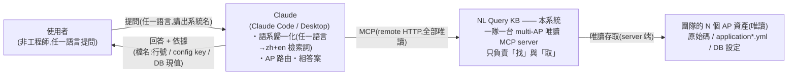
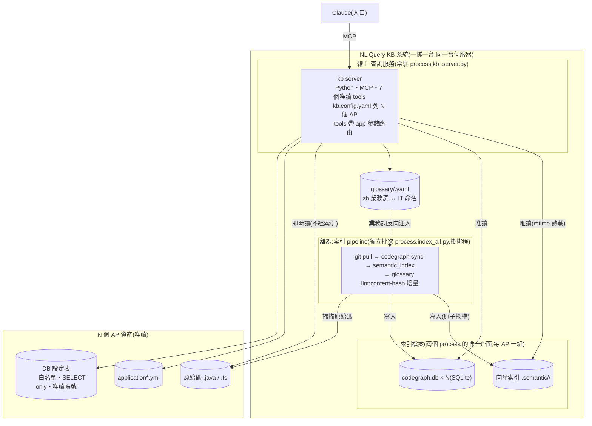
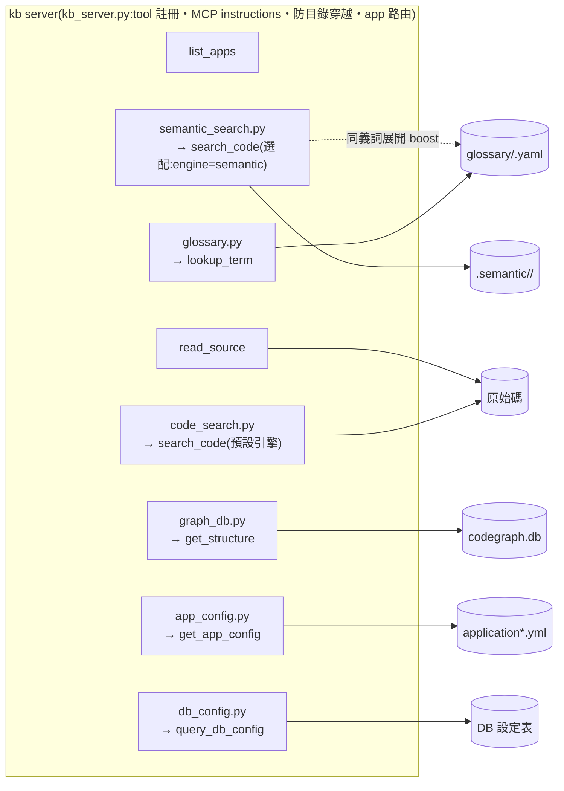

# SPEC — NL Query KB(自然語言查詢系統邏輯)

> 團隊架設:[QUICKSTART.md](QUICKSTART.md)。
> 驗證場域:BestHouse。

## 1. 目的與分工

使用者(非工程師)透過 Claude 用任何語言提問,由 Claude 讀取**當下真實的**
程式碼、AP config、DB 現值後回答,並附依據(檔名:行號 / config key / DB 現值)。

**分工:kb server 只負責「找」與「取」(全部唯讀);Claude 負責「懂」與「譯」**
(語系歸一化、AP 路由、讀 code 組答案)。安全機制(白名單、遮罩、唯讀)在
server 端強制,不依賴模型自律。

| 問題 | 解法 |
|---|---|
| 多語言提問 | Claude 檢索前改寫成「zh 業務詞 + en IT 詞」(慣例內建於 MCP instructions,§4.6) |
| 使用者用語 ≠ IT 命名 | glossary:zh 業務詞 ↔ it_terms 的精確錨點(repo 專屬知識,§4.1) |
| 使用者問題模糊、問不清楚 | server 回歧義訊號,Claude 以 KB 候選做選項式釐清(§4.8) |
| 不知道問題屬於哪個系統 | `app="all"` 跨 AP 探索,確認歸屬後切回單一 AP(§4.9) |
| 邏輯不只在 code | config tools 即時讀 yml 與 DB 現值(§4.4) |
| 規模(一隊一台,百萬行以內) | 離線預建索引,查詢期不全掃描(§4.2、§4.5) |

## 2. 部署形態

一個團隊架**一台 multi-AP server**:一份 server code + 一份設定列 N 個 AP,
tools 以 `app` 參數選系統,tool 總數固定 7 個。

| 模式 | 傳輸 | 對象 |
|---|---|---|
| 集中式(正式) | streamable HTTP + `KB_AUTH_TOKEN` Bearer 認證 | 使用者(Claude Desktop 加 Connector URL,零安裝);repo 與 DB 帳密只存伺服器 |
| 本機(開發) | stdio(.mcp.json) | 開發者除錯 |

## 3. 架構(C4)

### 3.1 Level 1 — System Context



### 3.2 Level 2 — Container



- **server 與 pipeline 互相獨立**:兩個 process、零呼叫關係,唯一介面是索引
  檔案——pipeline 寫入(tmp + 原子換名),server 以 mtime 偵測熱載(重建後
  不需重啟)。pipeline 掛掉只影響索引新鮮度,服務不中斷;索引未就緒時
  `engine: auto` 自動墊檔 grep。
- 查詢期只做 ANN + SQLite lookup + 即時讀現值,延遲與 repo 行數脫鉤。
- config tools 與 read_source 即時讀現值/原文,無 staleness。

### 3.3 Level 3 — Component



檢索三層,各司其職:

| 層 | 負責 | 不能省的原因 |
|---|---|---|
| glossary(名詞) | 業務用語 → IT 命名的精確錨點 | repo 專屬對應,Claude 猜不到 |
| 向量(語意) | 口語的模糊比對(zh/en) | 口語命中 en identifier + zh 註解,且可預建索引 |
| 圖(結構) | callers / callees / 跨檔追蹤 | 公式散在呼叫鏈上時需要「線」 |

## 4. 元件規格

### 4.1 glossary

- 每 AP 一份 YAML,進版控;**只維護 zh** aliases ↔ it_terms(其他語言由 Claude 翻譯)。
  ```yaml
  - term: 房子分數
    aliases: [總分, 評分, 分數]
    it_terms: [HOUSE_RATING, RATING_DIMENSION.WEIGHT, HouseService.calculateScore]
    note: 各維度分數 × 權重加總,權重存於 DB
  ```
- zh 子字串比對;**只存名詞對應、不存公式**(公式讓 AI 讀 code,不會過期)。
- 骨架由 `scripts/extract_glossary.py --app <name>` 產生,缺詞再補,不求全。
- **防腐化**:AP rename 後 it_terms 會默默失效 → `scripts/glossary_lint.py`
  對照 codegraph symbol / config key / DB 白名單檢測(任一 it_term 可解析即存活,
  全滅 = DEAD),`index_all.py` 每輪附帶執行,警示不擋索引;
  「該補哪些詞」由 log 報表的 S3 空手 query 提供(`scripts/log_report.py`)。

### 4.2 語意索引與引擎

- **索引單位**:symbol(method / class / config key),來自 codegraph。
- **embedding 輸入餵 NL 訊號,不餵整段 code**:identifier 拆詞 + 註解
  (kb 自行 UTF-8 抽取)+ class 名 + annotation + glossary 反向注入。
- **model**:預設 `intfloat/multilingual-e5-large`;輕量選項
  `paraphrase-multilingual-MiniLM-L12-v2`(索引快 15 倍,de 原文直查較弱;
  Claude 歸一化後 zh/en 無差)。`embed_model` / `KB_EMBED_MODEL` 切換,換 model 自動全量重建。
- **向量庫**:numpy 單檔內積(BestHouse < 1ms;百萬行以內 ~10 萬 symbols 仍 < 0.1s,一隊一台夠用);
  超出本定位(千萬行/高並發)才換 hnswlib/Qdrant,介面不變。
- **增量**:codegraph content-hash 判斷變更檔;glossary 或 model 變更自動全量。
- **混合排序**:ANN 相似度 + 字面 boost 按命中詞數累計
  (親打詞每詞 +0.08 封頂 0.24、glossary 展開詞每詞 +0.04 封頂 0.20)。
- **預設引擎 = grep(2026-07-09 起,依 ablation 定案)**:實測顯示
  **當 code 命名尚可、又有維護 glossary 時,語意索引相對 grep+glossary 幾乎零檢索增益**
  ——besthouse 10 題、top-3、同 glossary:zh+en semantic 18/20 vs grep 17/20,
  且該 1 題差異落在非 code 題(datasource,正解本應走 get_app_config)。原因:grep 引擎
  本身已做「英文 identifier + 中文 bigram 註解 + glossary 展開」三合一,涵蓋多數場景;
  且查詢前 Claude 已把口語歸一化為 zh+en、並經 lookup_term 展開成 IT 詞。
  完整數據見 `eval/ABLATION.md`。
- **semantic 保留為選配加速器**,判準三選一:(a) repo 大到查詢期 grep 全掃描會慢
  (現行 grep 為逐檔即時解析,大型 repo 才成瓶頸);(b) 命名極差且 glossary 補不動
  (純換句話說、零共同 token 的匹配只有 embedding 做得到);(c) 需要 `app="all"`
  跨 AP 探索(§4.9 目前只走 semantic,未建索引的 AP 會被略過)。
- **引擎依賴鏈(單向)**:codegraph 建圖 → 語意索引 → semantic 引擎。
  `engine: auto` 下索引未就緒/損壞時自動墊檔 grep(讀當下磁碟、零索引),就緒後自動切回。

### 4.3 get_structure

- 輸入 symbol → callers / callees / 位置;唯讀直讀 `codegraph.db`(鎖 schema v6,
  版本不符回警告不中斷)。
- `search_code` 可附一層呼叫鏈(`include_call_chain`,預設開)。
- **可信度界線**:tree-sitter 是語法層解析——Spring DI、interface 實作、反射、
  動態呼叫的邊抓不到,「沒有 caller」不等於沒人用;變更影響評估需全文搜尋交叉確認。
  根治 = 企業版換型別感知 indexer(SCIP-Java / Spoon)。

### 4.4 config tools

| Tool | 功能 | 安全 |
|---|---|---|
| `get_app_config(key_pattern, app)` | 解析 `application*.yml`,回 key/value 與來源檔 | 敏感 key 遮罩 |
| `query_db_config(table, limit, app, filter_column, filter_op, filter_value)` | 查 DB 設定表現值;可選「受限過濾」縮小範圍 | 白名單 + SELECT only;敏感表排除並附理由;過濾條件見下 |

遮罩無繞道:`read_source` 讀 yml/yaml/properties/.env 時逐行套同一套敏感值
遮罩(行數不變,行號引用不受影響)——否則「直接讀 yml 原文」會繞過
`get_app_config` 的遮罩拿到 DB 密碼/API key。

**受限過濾(Phase 9,已實作 2026-07-05)**——解決「表超過 MAX_ROWS=50 筆時,
目標資料可能不在回傳範圍且無從鎖定」的問題(如 HOUSE 表成長後查特定房屋):

- 簽名:`filter_column: str = ""`、`filter_op: str = "eq"`、`filter_value: str = ""`;
  三者皆空 = 現行整表行為,完全向下相容。
- 產生的 SQL 固定為單一條件:
  - `eq`:`SELECT * FROM {table} WHERE {column} = %s LIMIT %s`
  - `starts_with`:`SELECT * FROM {table} WHERE {column} LIKE %s LIMIT %s`
    (值包成 `value%`,前綴比對吃得到索引;跳脫規則同 contains)
  - `contains`:`SELECT * FROM {table} WHERE {column} LIKE %s LIMIT %s`
    (值包成 `%value%`,並跳脫值內的 `%`/`_`/`\`,LIKE 只當字面比對用;
    `%` 開頭必然全表掃描,tool docstring 引導模型 eq > starts_with > contains)
- **不是開放 WHERE**,每個組成都是封閉集合或繫結值:

| 組成 | 決定方式 | 為什麼安全 |
|---|---|---|
| 表名 | 白名單(現行,不變) | 必須先字串相等於 kb.config.yaml 白名單 |
| 欄位名 | 必須 ∈ 該表**實際欄位**(連線後由 driver metadata 取得,不分大小寫比對) | 欄位清單來自 DB schema,零人工維護;`1=1 OR` 這類字串比對不上直接拒絕,並回可用欄位清單供自我修正 |
| 運算子 | enum:`eq` / `starts_with` / `contains`,其他值拒絕 | 非自由字串,不進 SQL 內插 |
| 值 | 一律參數繫結(pymysql `%s` / oracledb `:v`) | 永不內插;contains 另跳脫萬用字元 |

- 只支援**單一條件**,不做 AND/OR 組合——複合過濾讓 Claude 分次查或自行在
  回傳中篩,維持注入面最小。
- 截斷警示:回傳筆數 = limit 時,尾註明確加上「已達上限,結果可能不完整;
  可用 filter_column 縮小範圍」(無論有無過濾都適用)。
- 雙保險不變:server 端白名單是第一道,DB 唯讀帳號(只授權白名單表 SELECT)
  是第二道;過濾功能不改變任何一道。
- **DB 端執行時間上限(2026-07-07)**:client 的 `read_timeout` 只切斷連線,
  DB 端查詢仍會跑完;現改為連線後下推 10 秒上限——MariaDB
  `SET SESSION max_statement_time=10`(MariaDB 11 實測,超時 errno 1969)、
  MySQL fallback `max_execution_time=10000`(毫秒)、Oracle `connection.call_timeout`。
  防止慢查詢(如大表 contains)在 DB 端堆積。
- 與 S4(§4.8)的配合:先整表(或 contains)找出同名多筆 → 使用者選定後,
  以 `eq` + 主鍵欄位精準取回該筆,不再受 50 筆上限影響。

### 4.5 規模矩陣(定位:一隊一台,百萬行以內)

| repo 規模 | 語意引擎 | 結構引擎 | 查詢延遲 |
|---|---|---|---|
| < 10 萬行 | 本地 embedding(首建秒~分鐘) | codegraph(tree-sitter) | < 1s |
| 10 萬 ~ 百萬行(≈ 5~10 萬 symbols) | 本地 embedding + numpy 單檔內積(float32 ≈ 400 MB,現行不用改;首建慢時用 MiniLM 或 GPU) | codegraph | < 0.1s |

- 一隊一台的合理上限即上表;numpy 暴力內積在 10 萬 symbols 仍 < 0.1s(單台團隊低 QPS)。
- 查詢期禁止全掃描;字面全掃描無法解口語比對,換 ripgrep 也一樣。
- **超出本定位**(單台千萬行 / 高並發 / 跨團隊聚合)的引擎替換(ANN、int8、GPU、分片、
  SCIP-Java)屬另一產品形態,詳見 docs/ENTERPRISE-GAP.md §6「範圍外參考」。

### 4.6 MCP instructions(內建於 server,Claude 連上即遵守)

1. 先判斷問題屬於哪個 AP,tools 帶 `app` 參數;不確定先 `list_apps`,再不確定問使用者。
   從描述判斷不出歸屬時,`search_code` / `lookup_term` 可帶 `app="all"` 做跨 AP 探索
   (discovery,§4.9);確認歸屬後必須切回該 app 深查,其餘工具不接受 all。
2. 檢索前把問題改寫成「zh 業務詞 + en IT 詞」兩組檢索詞。
3. 業務用語先 `lookup_term` 拿精確 IT 對應,再 `search_code`。
4. 公式散在呼叫鏈上用 `get_structure` 追。
5. 權重/規則/門檻/連線的「現值」必查 `query_db_config` / `get_app_config`,不得引用舊值。
6. 回答附依據(app 名 + 檔名:行號 / config key / DB 現值),以提問語言作答;查不到就明說。
7. 遇到歧義先向使用者做**選項式釐清**再繼續查:(a) 工具回傳標註「歧義訊號」
   (lookup_term 命中多個概念、search_code 結果分散或無結果附選項素材);
   (b) query_db_config 回傳中符合使用者所指對象的有多筆(如同名房屋)——
   以識別欄位列選項確認是哪一筆,不自行挑選。選項一律取自工具回傳的真實候選,
   最多問一次、1~2 個問題;問題清楚時不反問(§4.8)。

### 4.7 設定(kb.config.yaml)

```yaml
server_name: your-team-kb
apps:
  - name: your-app             # app 參數值
    description: 一句話說明     # Claude 路由依據,寫使用者聽得懂的話
    repo_root: ../your-app
    search_dirs: [backend/src, frontend/src]
    resources_dir: backend/src/main/resources
    entity_dir: backend/src/main/java/.../entity   # glossary 萃取用,可省略
    glossary: glossary/your-app.yaml
    db:
      driver: mariadb          # mariadb | oracle(oracle 未實測)
      table_whitelist: [YOUR_CONFIG_TABLE]
      sensitive_tables: {MEMBER: 含個資,排除}
engine: grep                   # 預設 grep(app 區塊可覆蓋);semantic | auto 為選配,見 §4.2
embed_model: ""                # 僅 semantic / auto 用;空 = e5-large
fleet: []                      # 選填:跨團隊轉介目錄,見 §4.10
```

編輯即時生效(mtime 快取),不需重啟 server;**例外:新增/移除 AP 需重啟**
(MCP instructions 的 AP 清單於啟動時組定)。app name「all」為保留字
(跨 AP 查詢用,§4.9),載入時 fail fast。環境變數:
`KB_TRANSPORT`(stdio|http)、`KB_HTTP_HOST/PORT`(預設 127.0.0.1:8600)、
`KB_AUTH_TOKEN`(http 的 Bearer 認證)、`KB_ENGINE`、`KB_EMBED_MODEL`、
`KB_LOG_LEVEL`(預設 INFO)、`KB_LOG_FILE`(設定時 log 另寫檔案)。

logging(kb_log.py):stdio 模式 stdout 是 MCP 協定通道,log 一律走 stderr
(+ 可選檔案)。INFO 記 tool 呼叫(參數摘要/結果大小/耗時)、歧義訊號 S1~S3
(供 Phase 8 誤觸發率調校)、索引與設定載入;WARNING 記拒絕事件
(白名單/敏感表/filter 驗證/路徑穿越/HTTP 401)與引擎降級;ERROR 記 DB 連線失敗。
log 彙整:`scripts/log_report.py`(用量/耗時、S1~S3 統計、S3 → glossary 補詞候選)。

HTTP 模式另提供 `GET /health`(**免認證**,刻意——監控/排程檢查用,
僅回 server 存活與各 AP 的 repo/codegraph/語意索引狀態與 built_at,無敏感資料)。

### 4.8 歧義釐清(使用者問不清楚時的反問能力)

**分工不變**:反問屬「懂」的一側,由 Claude 執行;server 只負責在工具回傳中
附上**歧義訊號**與**選項素材**,讓 Claude 知道「何時該問、拿什麼當選項」。
server 保持無狀態唯讀——釐清是 Claude 對話層的多輪互動,不落 server。

server 端實作三種歧義訊號(S1~S3);S4 **不是 server 功能**——是 instructions
#7(b) 引導 Claude 從 `query_db_config` 回傳資料自行辨識的情境,一併列於下表:

| 訊號 | 觸發條件 | 回傳內容(選項素材) |
|---|---|---|
| S1 glossary 多義 | `lookup_term` 命中 ≥ 2 個**彼此獨立**的概念(命中字串互不包含;「不含車位單價」同時命中「車位」不算,「戶梯比」+「管理費」才算) | 條目照常回傳,前面加提示行:「命中 N 個不同概念,若無法從問題判斷是哪一個,請先確認」;每條目的 term + note 即是選項 |
| S2 檢索分散 | `search_code`(semantic)top-k 分數平坦(top1 − top3 < Δ,Δ 初值 0.03 待調)**且**命中散在 ≥ 3 個不同 class | 結果照常回傳,尾端附註:「結果分散(散在 A、B、C),若不確定使用者要問哪個功能,先以此為選項釐清」 |
| S3 檢索空手 | `search_code` 無結果或全部低於 `_MIN_SCORE`(semantic 與 grep 引擎皆同) | 「無足夠相關」訊息之外,附該 AP glossary 的 term 清單(與 lookup_term 無命中時的行為一致化),Claude 可轉成選項問使用者 |
| S4 DB 多筆同名 | `query_db_config` 回傳中,符合使用者所指對象的資料有**多筆**(如 HOUSE 表 4 筆同名「竹科悅揚」) | 無需 server 端偵測——表格已含全部欄位;instructions #7(b) 要求 Claude 以識別欄位(ID/樓層/坪數/總價等)列選項,確認是哪一筆後才作答 |

提問慣例(instructions #7,§4.6):**選項式**(選項來自 KB 真實候選,不憑空編)、
**最多問一次**(1~2 個問題)、**清楚就不問**(既有清晰題不得誤觸發)。

設計取捨:

- **不加第 8 個 tool**(曾考慮 `clarify_question(query, app)`):「這個使用者想問哪個意思」
  server 無從判斷,只能提供訊號;獨立 tool 只是把同樣的訊號換個入口,反而多一次呼叫。
  tool 總數維持 7。
- **不在 glossary 加 `ask` 欄位**(預寫釐清問句):選項素材 term/note 已足夠 Claude 組問題,
  多一個欄位就多一份維護成本;真實使用發現不足時再議。
- **誤觸發控制**:S2 門檻(Δ、模組數)以 eval 清晰題調校——寧可少問,不可煩人。

### 4.9 跨 AP 聯合查詢(Phase 11,已實作 2026-07-06)

> **依賴語意索引,預設關閉(2026-07-09)**:`search_code(app="all")` 只走 semantic
> 引擎(見下),而預設引擎已改為 grep(§4.2),故未對任一 AP 開 `engine: semantic/auto`
> 時,discovery 會把每個 AP 標為「略過(索引未就緒)」——等於停用。AP 數少、`list_apps`
> 描述清楚時,靠描述路由即足夠;AP 多到描述難以路由,再對欲納入 discovery 的 AP 開
> semantic。`lookup_term(app="all")` 只用 glossary,不受此限,照常可用。

**動機**:使用者不知道功能屬於哪個系統(「哪個系統會產生條碼?」),
`list_apps` 的一句話描述不足以路由時,現況只能逐一猜。

**設計**:不加新 tool——`search_code` 與 `lookup_term` 的 `app` 參數接受
特殊值 **`all`**,語意為「discovery 模式」:

- 逐 AP 執行,結果**按 AP 分組標示**;search_code 每 AP 只取 top 2(discovery
  等級,非深查),query 向量只嵌入一次、對各 AP 向量庫重用(效能)。
- `all` 只走 semantic 引擎;未建索引的 AP 標註「略過(索引未就緒)」,
  不做跨 AP grep 全掃(延遲不可控)。
- **防護欄(「不跨 AP 亂猜」原則不變)**:instructions 更新——`all` 僅供
  「找不到歸屬」時的 discovery;找到歸屬後**必須**切回單一 app 深查;
  回答不得混用不同 AP 的來源而不標明 app 名。
- `query_db_config` / `get_app_config` / `read_source` / `get_structure`
  **不開放 `all`**:現值與檔案存取必須明確指定系統。

### 4.10 跨團隊轉介(fleet 目錄,2026-07-10)

**動機**:使用者常問到「不歸本 server 管」的系統(關聯系統極多,且部分團隊
不會裝 Rosetta)。MCP 協定沒有 server 間轉接機制,server 能做的是回傳
「這屬於誰、去哪問」的指引,由 Claude 引導使用者。

**設計**:`kb.config.yaml` 選填 `fleet:` 目錄——每條目 = 一個其他團隊,
`team` 必填(至少能告訴使用者找誰),`server`/`endpoint`/`docs` 選填,
`apps` 列該團隊的系統(`name` + `description` 必填、`keywords` 選填)。
**對方不需要裝 Rosetta 就能列進目錄**:有 endpoint 的引導使用者連對方
Rosetta 續問(雙方都有 Rosetta 時的無縫路徑);沒有的給聯絡窗口/文件
(純轉介),提供漸進採用路徑——對方日後裝了 Rosetta,補 endpoint 即可。

三個掛載點(不加新 tool,tool 總數維持 7):

- **`list_apps`** 尾端附「其他團隊的系統」區段:Claude 路由時本來就先看
  這個 tool,描述吻合即轉介。
- **檢索空手時**(`lookup_term` 無命中、`search_code` 無結果、all 模式全空):
  問題詞彙與 fleet 條目的 `name`/`keywords` 字面吻合(子字串、不分大小寫)
  時附「轉介訊號」與該條目的指引(最多 3 筆);不吻合時附一句話指向
  list_apps 的轉介區段。`description` 只給 Claude 路由,不參與字面比對。
- **instructions #8**(設定了 fleet 才加):不歸本 server 管的問題不硬答,
  依轉介區段引導;轉介只給指引,不代答其他團隊系統的內容。

**防護欄**:fleet app 與本機 app 同名時載入 fail fast;fleet 條目只產生
轉介文字,不觸發任何檢索/檔案/DB 存取。目錄由本團隊維護(建議放共用
git repo,各團隊自己 PR 自己的區段);新增/移除 fleet 需重啟 server
(instructions 於啟動時組定),條目內容修改即時生效(mtime 快取)。

**設計取捨**:曾考慮中央 router/gateway MCP(單一入口代轉查詢)——
多一個要維運的服務、單點故障、且代轉等於穿透各團隊的資料邊界,
以「一隊一台」定位不採;純 client 端多連線(使用者自己連多台 Rosetta)
只對已連線者有效,無法涵蓋「還沒連/對方沒裝」的情境,列為輔助路徑。

## 5. 驗收標準

- zh 母本 10 題(涵蓋 code / DB / yml / 跨源),門檻 **≥ 9/10**;
  de / ja 各抽 2 題,引用來源需與 zh 版一致(ja 題只存資料檔)。
- 每題:引用正確來源、無幻覺、跨源題同時引 code 與 DB 現值。
- 多 AP 路由:模糊問題應選對 `app` 或先確認,不得跨 AP 引用。
- 歧義釐清(§4.8):模糊題 5 題應先以 KB 候選做選項式釐清、釐清後命中正確來源;
  既有清晰 10 題誤觸發反問 ≤ 1/10。
- 驗收方式:**人工逐題實測**——在 Claude 逐題提問,核對回答與題庫的
  expected / expected_source(eval/questions.yaml、questions-vague.yaml)。
- 延遲:search_code < 1s(BestHouse);規模外推見 §4.5。

## 6. 非目標

- 不做 Web UI、不做寫入、不做權限控管/多使用者、不做即時索引(分鐘級 staleness 可接受)。
- 不做變更歷史查詢(git log 包成 tool):「何時改、為何改」的價值不敵
  git 歷史量體灌爆對話的風險,評估後決定不做(2026-07-06)。
- 不做 E2E 自動驗收腳本(曾有 scripts/eval_e2e.py):headless claude 逐題實測
  受帳號 rate limit 退避影響,單題耗時不可控、逾時誤判 ERROR,自動化不可靠,
  移除改採人工驗收(2026-07-07)。
- 不實測百萬行效能(試算外推);Claude 通道選型與資安審查為企業導入議題。

## 7. 已知限制

- `query_db_config` 上限 50 筆:整表查詢在大表會截斷(有警示),
  查特定對象請用受限過濾(§4.4)縮小範圍。
- Oracle driver 程式就緒但**未實測**(含受限過濾的 Oracle 分支);
  首個 Oracle AP 導入前先驗。
- HTTP 未設 `KB_AUTH_TOKEN` 時無認證,僅限信任內網;token 注入依 Claude 通道能力,
  必要時走反向代理。
- codegraph 圖缺 DI/反射邊(§4.3);中文 docstring 在 Windows 為亂碼,註解由 kb 自抽。
- 絕對路徑:搬移目錄後重跑 `scripts/setup.ps1`。

## 8. 範圍外差距(超出「一隊一台、百萬行以內」定位)

> 本系統定位在一隊一台、百萬行以內(§4.5);下表為**超出定位**(單台千萬行 /
> 高並發 / 跨團隊聚合)才需要的替換,屬另一產品形態。完整外推見 docs/ENTERPRISE-GAP.md。
> 例外:結構檢索與 Oracle 是「正確性/相容性」議題,與規模無關,定位內也建議處理。

| 面向 | 現況(百萬行內夠用) | 超出定位時(千萬行/跨團隊) |
|---|---|---|
| 語意檢索 | 本地 embedding + numpy 單檔(float32,~10 萬 symbols < 0.1s) | hnswlib/Qdrant、分片、int8 量化、GPU 批次嵌入 |
| 結構檢索 | codegraph(tree-sitter) | SCIP-Java / Spoon(型別感知,補 DI 邊)—— 為正確性,非規模 |
| 索引更新 | 排程 index_all + content-hash 增量 | CI on commit + 向量庫 upsert |
| config 查詢 | 直讀 yml + MariaDB(與行數脫鉤) | config center / 各 AP DB 唯讀帳號;Oracle 驗證(相容性,定位內先做) |
